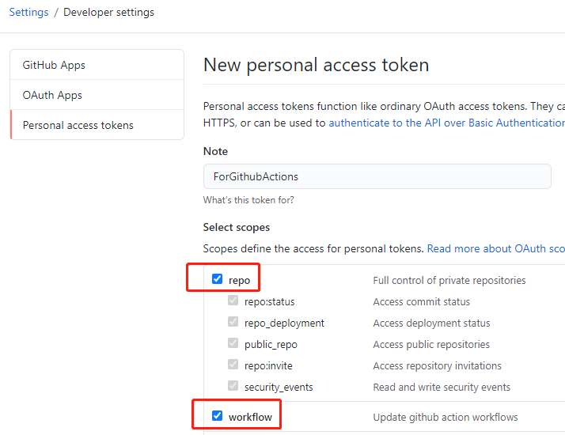

# 特别声明:

-   本仓库发布的 MyActions 项目中涉及的任何解锁和解密分析脚本，仅用于测试和学习研究，禁止用于商业用途，不能保证其合法性，准确性，完整性和有效性，请根据情况自行判断.

-   本项目内所有资源文件，禁止任何公众号、自媒体进行任何形式的转载、发布。

-   sazs34 对任何脚本问题概不负责，包括但不限于由任何脚本错误导致的任何损失或损害.

-   间接使用脚本的任何用户，包括但不限于建立 VPS 或在某些行为违反国家/地区法律或相关法规的情况下进行传播, sazs34 对于由此引起的任何隐私泄漏或其他后果概不负责.

-   请勿将 MyActions 项目的任何内容用于商业或非法目的，否则后果自负.

-   如果任何单位或个人认为该项目的脚本可能涉嫌侵犯其权利，则应及时通知并提供身份证明，所有权证明，我们将在收到认证文件后删除相关脚本.

-   任何以任何方式查看此项目的人或直接或间接使用该 MyActions 项目的任何脚本的使用者都应仔细阅读此声明。sazs34 保留随时更改或补充此免责声明的权利。一旦使用并复制了任何相关脚本或 MyActions 项目的规则，则视为您已接受此免责声明.

    **您必须在下载后的 24 小时内从计算机或手机中完全删除以上内容.**  

    > **_您使用或者复制了本仓库且本人制作的任何脚本，则视为`已接受`此声明，请仔细阅读_**

# 说明:

鉴于 lxk0301 大佬的分支因为 fork 过多用于执行 actions 导致被删，为了防范于未然

> 麻烦各位**不要 fork**`不要fork` _不要 fork_ 不要 fork 不要 fork,通过下面的方法重新创建分支，同步代码

[此方式亲测可行，请放心食用，点击查看如何使用 reposync 的方式进行同步代码]

# 通过reposync方式进行代码同步

## Why

鉴于lxk0301大佬的分支因为fork过多用于执行actions导致被删，为了防范于未然

麻烦各位**取消掉fork**,通过下面的方法重新创建分支，同步代码

此方式亲测可行，请放心食用

## How

### 创建新仓库

[点击创建自己的仓库](https://github.com/new)

填入`Repository name`后点击最下方的`Create repository`即可完成创建

### 自己创建工作流

在创建完成页面点击`Actions`再点击`set up a workflow yourself`

复制 https://github.com/insChow/auto_repo-sync/blob/master/.github/workflows/sync-scripts.yml里面的代码

复制完毕后直接点击右上角的`Start commit`后直接`Commit new file`即可

### 申请PAT

点击 GitHub [用户设置页面](https://github.com/settings) 最下方的`Developer setting` ，然后选择 [`Personal access tokens`(点击快捷到达指定页面)](https://github.com/settings/tokens/new) 来生成一个 token，把 `repo`和`workflow` 两部分勾上即可。

点击最下面的创建按钮后，图示部分即为你的PAT(图示的已经删除了,仅为演示)，复制下来马上就要使用了

### 填写PAT到Secrets

申请完毕后，在分支中点击`Settings`-`Secrets`-`New secret`

`name`填`PAT`，`Value`填入上方申请到的PAT,保存即可

### 手动触发一次代码同步

点击`Actions`,找到指定的脚本,按图示运行一次

等待两分钟左右,能够发现代码全部同步过来了

## Enjoy

操作到这一步,表示您已经全部完成了

剩下的去配置cookie等secrets就好啦

